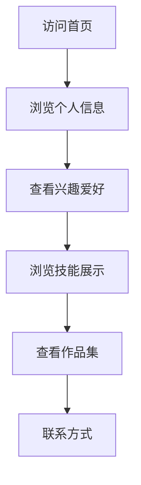

## 1. Product Overview
个人主页展示商务数据分析与应用专业学生的个人信息、兴趣爱好和技能。
- 目标用户：同学、老师、潜在雇主，用于展示个人特色和专业背景。
- 产品价值：通过视觉吸引力和个性化内容，打造独特的个人品牌形象。

## 2. Core Features

### 2.1 User Roles
| 角色 | 注册方式 | 核心权限 |
|------|---------------------|------------------|
| 访客 | 无需注册 | 浏览所有内容 |

### 2.2 Feature Module
1. **首页**：个人信息展示、兴趣爱好、技能展示、作品集、联系方式

### 2.3 Page Details
| 页面名称 | 模块名称 | 功能描述 |
|-----------|-------------|---------------------|
| 首页 | 个人信息区 | 展示姓名、专业、个人简介、照片 |
| 首页 | 兴趣爱好区 | 展示美食、旅游、摄影等兴趣爱好 |
| 首页 | 技能展示区 | 展示数据分析相关技能和工具 |
| 首页 | 作品集 | 展示数据分析项目和作品 |
| 首页 | 联系方式 | 提供社交账号和联系方式 |

## 3. Core Process
用户访问首页 → 浏览个人信息和兴趣爱好 → 查看技能和作品集 → 通过联系方式进行沟通

## 4. User Interface Design
### 4.1 Design Style
- 主色调：粉色系（#FFB6C1、#FFC0CB、#FF69B4）
- 辅助色：白色、浅灰色
- 按钮风格：圆角、柔和阴影
- 字体：无衬线字体，标题使用可爱风格字体
- 布局风格：卡片式布局，清新简洁
- 图标风格：简约线条图标，搭配粉色系

### 4.2 Page Design Overview
| 页面名称 | 模块名称 | UI元素 |
|-----------|-------------|-------------|
| 首页 | 个人信息区 | 圆形头像、粉色渐变背景、大号标题字体、简短个人介绍 |
| 首页 | 兴趣爱好区 | 卡片式布局，每个爱好配有图标和简短描述，hover效果 |
| 首页 | 技能展示区 | 进度条或雷达图展示技能水平，粉色主题 |
| 首页 | 作品集 | 网格布局，项目卡片带有缩略图和简短描述 |
| 首页 | 联系方式 | 社交图标链接，简约表单样式 |

### 4.3 Responsiveness
- 桌面优先设计，响应式适配平板和移动设备
- 移动设备上采用单列布局，优化触摸交互

### 4.4 3D Scene Guidance
- 无3D场景需求